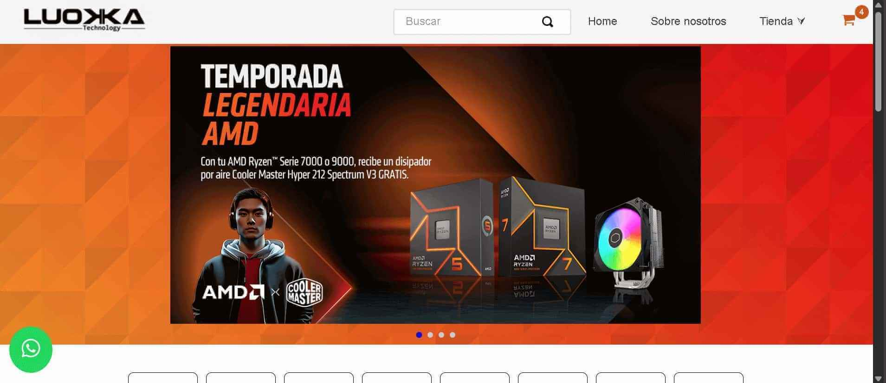
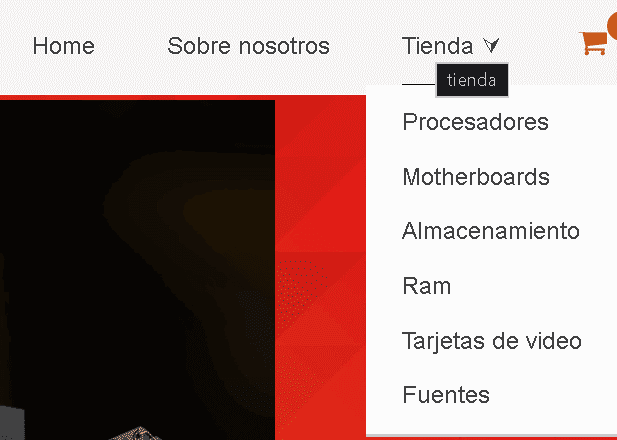
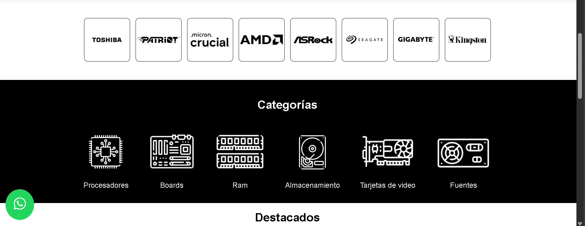
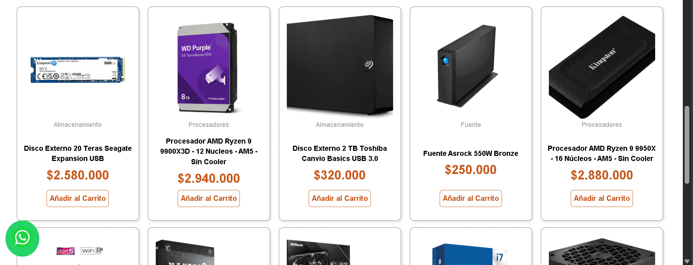
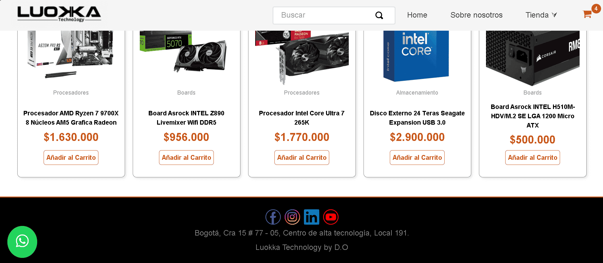
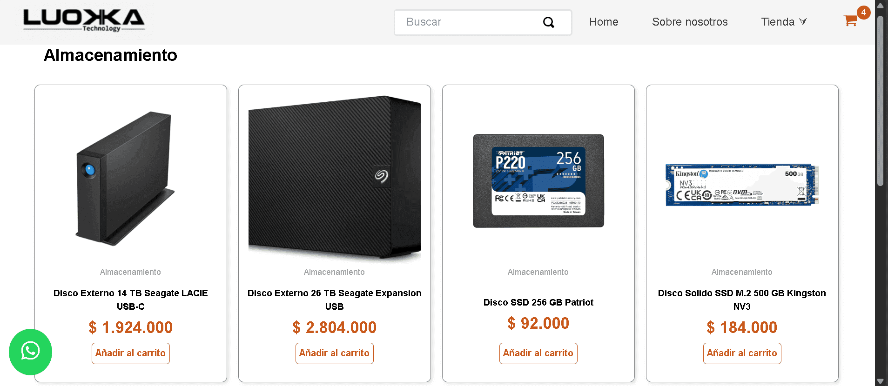
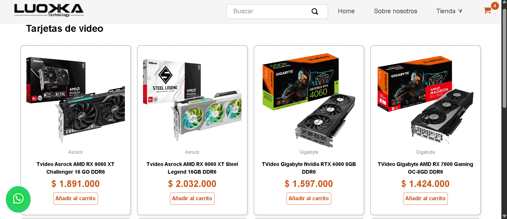
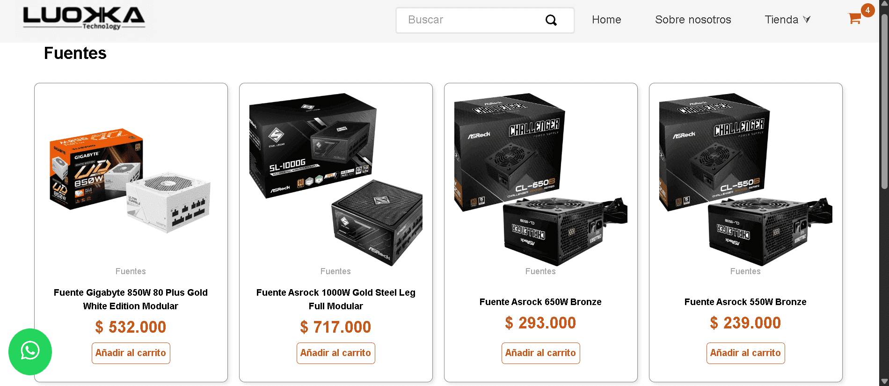
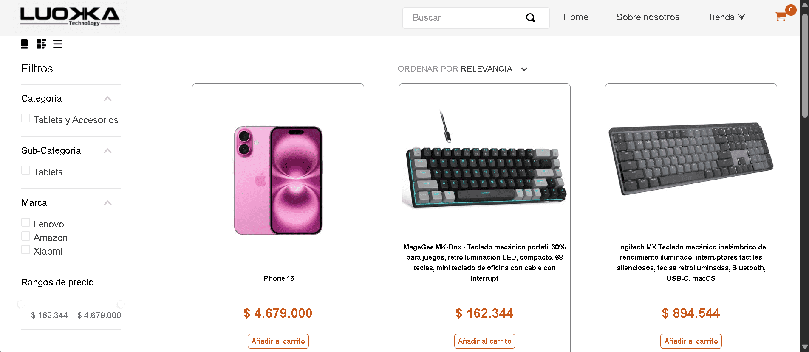
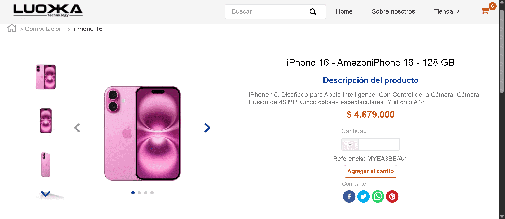

# Tienda Luokka

La tienda **Luokka** está diseñada específicamente para una tienda de comercio electrónico especializada en componentes de computadora y hardware de alto rendimiento. Este tema ofrece un diseño limpio, moderno y responsivo, enfocado en la experiencia de usuario y la exhibición detallada de productos.

* [🚀 Visión General](#-visión-general)
* [✨ Características Principales](#-características-principales)
* [🖼️ Previsualización de la Tienda](#-previsualización-de-la-tienda)
* [🛠️ Stack de Tecnologías](#-stack-de-tecnologías)
* [🏗️ Configuración Inicial del Proyecto](#-configuración-inicial-del-proyecto)
* [📂 Estructura y Configuración de Bloques](#-estructura-y-configuración-de-bloques)
* [🎨 Personalización de Estilos](#-personalización-de-estilos)
* [🪪 Contribución y Licencia](#-contribución-y-licencia)

## 🚀 `Visión General`

Este E-commerce está construido sobre la plataforma **VTEX IO**, utilizando las mejores prácticas y componentes nativos para garantizar la estabilidad, el rendimiento y la escalabilidad. El proyecto **Luokka** está orientado a la venta de productos tecnológicos como `procesadores`, `motherboards`, `tarjetas de video` y más, con una estructura de navegación intuitiva y personalizaciones específicas, ya que es una réplica de la tienda original.

**Enlace de la Tienda Original**: https://luokka.co/


## ✨ `Características Principales`

*   **Diseño Responsivo:** Interfaz totalmente adaptable que garantiza una experiencia óptima en dispositivos de escritorio, tablets y móviles.
*   **Estructura Modular:** Construido con `Flex Layout` y `Responsive Layout` para una fácil personalización de la estructura de las páginas.
*   **Componentes Personalizados:** Incluye componentes custom como `whatsapp-button`, `bullets-group` y `custom-grid` para funcionalidades extendidas.
*   **Navegación Intuitiva:** Menús y departamentos bien definidos para una fácil exploración de categorías de productos.
*   **Páginas Estáticas:** Páginas de categorías con un shelf estático implementado con flex-layout para demostración.
*   **Estilos Centralizados:** Gestión avanzada de la apariencia mediante `style.json` y archivos CSS dedificados a cada bloque en especifico, asegurando consistencia visual en toda la tienda.


## 🖼️ `Previsualización de la Tienda` 



> ### Menu








> ### Categoria Procesadores


> ### Categoria Motherboards


> ### Categoria Almacenamiento


> ### Categoria Tarjetas de Video


> ### Categoria Fuentes


> ### PLP


> ### PDP



## 🛠️ `Stack de Tecnologías`

*   **Plataforma**: VTEX IO
*   **Configuración**: Desarrollo declarativo mediante bloques en JSONC.
*   **Navegación y SEO**: VTEX Intelligent Search y Routes API.

### `Componentes VTEX IO`
Este tema utiliza un conjunto de aplicaciones estándar y personalizadas de VTEX IO. 

Las dependencias clave incluyen:

*   `vtex.store`: El motor principal de la tienda.
*   `vtex.store-header` y `vtex.store-footer`: Para la cabecera y pie de página.
*   `vtex.store-components`: Para componentes comunes de la tienda.
*   `vtex.product-summary` y `vtex.product-details`: Para la visualización de productos.
*   `vtex.shelf`, `vtex.carousel`, `vtex.slider-layout`: Para carruseles y estanterías de productos.
*   `vtex.flex-layout`, `vtex.responsive-layout`: Para la maquetación flexible y responsiva.
*   `vtex.menu`: Para la navegación y menú lateral.
*   `vtex.login`: Para el inicio de sesión y registro.
*   `vtex.minicart`: Para el carrito de compras.
*   `vtex.search-result`: Para la busqueda de productos.

* **Entre otros**...

### `Componentes Personalizados 👇`
Para las funcionalidades exclusivas de estos componentes (como QuickOrder o CustomGrid), se utilizó:

* **Frontend**: React con TypeScript para un desarrollo tipado y seguro.

* **Data Fetching**: GraphQL (Apollo Client) para consultas eficientes a las APIs de VTEX.

* **Lógica de Estado**: React Hooks (useState, useEffect).

> #### 🎨 Diseño y Sistema de Estilos

* **Framework Base**: Tachyons (Nativo en VTEX para utilidades rápidas).

* **Personalización**: CSS Modules para evitar colisiones de estilos en componentes custom.

* **Consistencia**: VTEX Styleguide para elementos de UI (botones, inputs, tipografía).

Se han desarrollado los siguientes componentes a medida para extender la funcionalidad  e interactividad de la tienda:

  *   `itglobers.whatsapp-button`: Botón de contacto directo por WhatsApp.
  *   `itglobers.bullets-group`: Para la creación de listados de características destacadas con su respectiva imagen y redirección.
  *   `itglobers.quick-order`: Formulario de compra rápida que permite buscar productos por SKU y añadirlos directamente al checkout de la tienda.
  *   `itglobers.custom-grid`: Para grillas de imágenes con diseños personalizados y de facil uso.

> Puedes consultar todas las dependencias del proyecto en el archivo `manifest.json` de la tienda **Luokka**.

## 🏗️ `Configuración Inicial del Proyecto`

Para trabajar con este tema en tu entorno de desarrollo local, sigue estos pasos:

1.  **Inicia sesión en tu cuenta de VTEX:**
    ```bash
    vtex login {accountName}
    ```

2.  **Clona el repositorio y navega a la carpeta del proyecto.**
    ```bash
    git clone https://github.com/Camilo-2003/Store-Theme-Luokka.git
    cd Store-Theme-Luokka
    ```

3.  **Vincula el tema a tu workspace de desarrollo:**
    ```bash
    vtex link
    ```
    Una vez vinculado, la tienda reflejará los cambios que realices en el código en tiempo real.

4.  **Para instalarlo en un workspace y publicarlo:**
    ```bash
    vtex install
    vtex publish
    ```

## 📂 `Estructura y Configuración de Bloques`

La estructura de las páginas y su contenido se define en archivos **.jsonc** en la carpeta `store/blocks`.

```json
├── assets/
├── docs/
├── store/
│   ├── blocks/
│   │   ├── desktop/
│   │   ├── mobile/
│   │   ├── tablet/
│   │   └── global/
│   │       ├── components/
│   │       │   ├── custom/
│   │       │   ├── footer/
│   │       │   ├── header/
│   │       │   ├── home/
│   │       │   ├── pages/
│   │       │   └── pdp/
│   │       └── screen/
│   └── routes.json
├── styles/
│   ├── configs/
│   │   └── style.json
│   └── css/
└── manifest.json
```


*   **`store/blocks/`**: Contiene la definición principal de los bloques.
    *   **`desktop/`**: Contiene bloques específicos que sobreescriben o complementan la configuración para dispositivos de escritorio.
    *   **`mobile/`**: Contiene bloques específicos que sobreescriben o complementan la configuración para dispositivos móviles. 
    *   **`tablet/`**: Contiene bloques específicos que sobreescriben o complementan la configuración para dispositivos de tablet.
    *   **`global/`**: Define bloques que son consistentes a través de diferentes páginas, como el header y el footer.
    *   **Archivos Principales**:
        *   `home.jsonc`: Define la estructura de la página de inicio.
        *   `product.jsonc`: Define la estructura de la página de detalles del producto (PDP).
        *   `plp.jsonc`: Define la estructura de las páginas de listado de productos (PLP) o categorías.
        *   Dentro de `pages/` se definen las páginas de categorías como `procesadores.jsonc`, `motherboards.jsonc`, etc.

Para modificar la disposición de los componentes, debes editar los archivos correspondientes en la carpeta **`store/blocks`**, añadiendo, eliminando o reordenando los bloques declarados allí.

## 🎨 `Personalización de Estilos`

La personalización visual del tema se gestiona desde la carpeta `styles`.

*   **`styles/configs/style.json`**: En este archivo se definen las variables globales de estilo (Tokens CSS) como colores, tipografía, espaciado, etc. Modificar este archivo es la forma más eficiente de aplicar un cambio de estilo a lo largo de toda la tienda.

*   **`styles/css/`**: Esta carpeta contiene archivos CSS que aplican estilos específicos a los componentes de VTEX (y a los componentes personalizados). Cada archivo está nombrado según el bloque al que aplica los estilos (por ejemplo, `vtex.product-summary.css, vtex.rich-text.css`).
    *   Para personalizar un componente, busca su archivo CSS correspondiente y modifica o añade las clases CSS necesarias. Puedes descubrir las clases disponibles para cada componente en su documentación oficial o inspeccionando el DOM de la tienda.

## 🪪 `Contribución y Licencia`

### 🤝 Contribución

Si deseas contribuir con mejoras, reportar *bugs* o sugerir nuevas características:

1.  Haz un *fork* del repositorio.
2.  Crea una nueva rama (`git checkout -b feature/nueva-funcionalidad`).
3.  Realiza tus cambios y haz *commit* (`git commit -m 'feat: Añadir nueva funcionalidad'`).
4.  Sube la rama (`git push origin feature/nueva-funcionalidad`).
5.  Abre un *Pull Request*.

### 📜 Licencia

Este proyecto está bajo la **Licencia MIT**.

> **[](https://opensource.org/licenses/MIT)**
> **[](https://github.com/vtex-apps/whatsapp-button/blob/main/LICENSE)**
> **[](https://github.com/vtex-apps/whatsapp-button/blob/main/CONTRIBUTING.md)**

